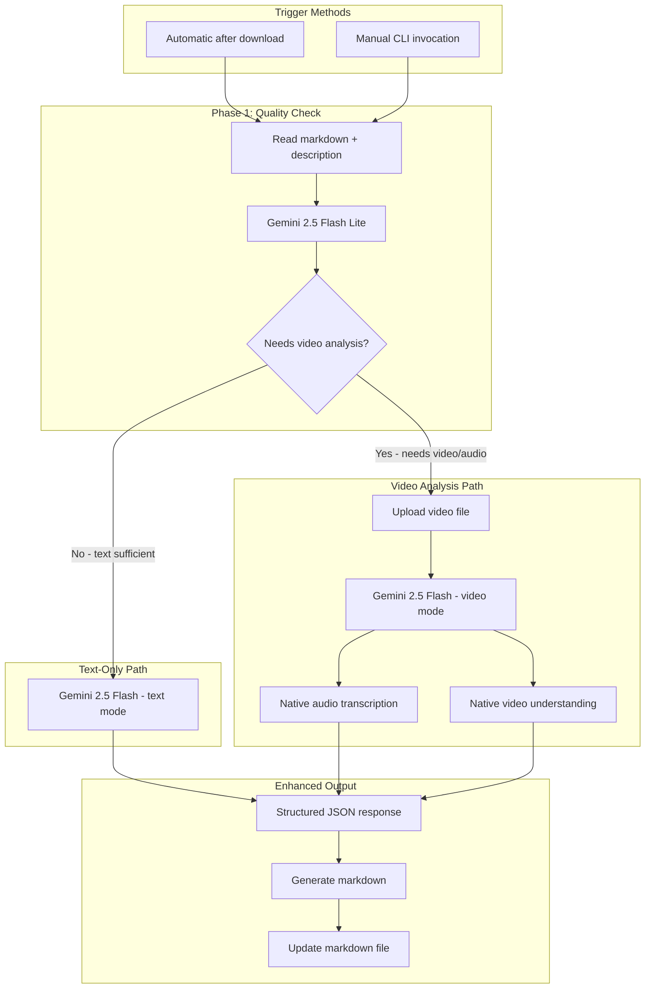

# AI-Powered Instagram Reel Content Enhancer

## Overview

Create a new `ai_enhancer.py` script that processes downloaded Instagram reels using **Google Gemini SDK only**:

- **Gemini 2.5 Flash Lite** - Quality check (fast, cheap)
- **Gemini 2.5 Flash** - Text enhancement and video/audio analysis

Single SDK, single API key, maximum simplicity.

## Architecture



## Model Selection

| Task | Model | Why |

|------|-------|-----|

| Quality Check | Gemini 2.5 Flash Lite | Fastest, cheapest - just needs yes/no decision |

| Text Enhancement | Gemini 2.5 Flash | Good reasoning for content cleanup |

| Video + Audio Analysis | Gemini 2.5 Flash | Native multimodal, up to 45 min video |

## Structured Output Schemas

All AI responses use structured outputs via JSON schema:

```python
from pydantic import BaseModel

class QualityCheckResponse(BaseModel):
    """Response from quality check (Gemini 2.5 Flash Lite)"""
    has_sufficient_detail: bool
    reasoning: str
    confidence: float  # 0.0 to 1.0

class EnhancedContent(BaseModel):
    """Response from content enhancement"""
    title: str
    summary: str
    key_points: list[str]
    tags: Tags
    references: list[Reference]
    transcript: str | None  # Only if audio was analyzed

class Tags(BaseModel):
    topic: list[str]         # e.g., ["programming", "python"]
    content_type: list[str]  # e.g., ["tutorial", "tips"]
    action: list[str]        # e.g., ["reference", "try-later"]

class Reference(BaseModel):
    title: str
    url: str
    description: str
```

## Implementation Details

### New File: `ai_enhancer.py`

**Core Components:**

```python
from google import genai
from google.genai import types
from pydantic import BaseModel

class GeminiClient:
    """Unified client for all Gemini operations using google-genai SDK"""
    
    def __init__(self, api_key: str):
        self.client = genai.Client(api_key=api_key)
        self.flash_lite_model = "gemini-2.5-flash-lite"
        self.flash_model = "gemini-2.5-flash"
    
    def check_quality(self, description: str) -> QualityCheckResponse:
        """Quick quality check with Flash Lite"""
        response = self.client.models.generate_content(
            model=self.flash_lite_model,
            contents=QUALITY_CHECK_PROMPT.format(description=description),
            config=types.GenerateContentConfig(
                response_mime_type="application/json",
                response_schema=QualityCheckResponse
            )
        )
        return QualityCheckResponse.model_validate_json(response.text)
    
    def enhance_text(self, description: str, author: str) -> EnhancedContent:
        """Text-only enhancement with Flash"""
        response = self.client.models.generate_content(
            model=self.flash_model,
            contents=TEXT_ENHANCE_PROMPT.format(description=description, author=author),
            config=types.GenerateContentConfig(
                response_mime_type="application/json",
                response_schema=EnhancedContent
            )
        )
        return EnhancedContent.model_validate_json(response.text)
    
    def analyze_video(self, video_path: str, description: str) -> EnhancedContent:
        """Full video + audio analysis with Flash"""
        # Upload video file to Gemini
        video_file = self.client.files.upload(file=video_path)
        
        response = self.client.models.generate_content(
            model=self.flash_model,
            contents=[video_file, VIDEO_ANALYZE_PROMPT.format(description=description)],
            config=types.GenerateContentConfig(
                response_mime_type="application/json",
                response_schema=EnhancedContent
            )
        )
        
        # Clean up uploaded file
        self.client.files.delete(name=video_file.name)
        
        return EnhancedContent.model_validate_json(response.text)
```

### Prompts

**Quality Check (Flash Lite):**

```
Analyze this Instagram reel description. Does it contain enough detail 
to understand what the reel teaches or shows?

Description: {description}

Return has_sufficient_detail=true if the description clearly explains the content.
Return has_sufficient_detail=false if it's vague, mostly hashtags/emojis, or promotional fluff.
```

**Text Enhancement (Flash):**

```
Clean up this Instagram reel description for my personal notes.

Description: {description}
Author: {author}

Generate:
1. A clear, descriptive title (not clickbait)
2. A concise summary of the actual content
3. Key points as bullet points
4. Relevant tags:
   - topic/* (e.g., topic/programming, topic/fitness)
   - type/* (e.g., type/tutorial, type/tips)
   - action/* (e.g., action/todo, action/reference)
5. 2-3 reference links to related resources (documentation, articles, etc.)
```

**Video Analysis (Flash):**

```
Analyze this Instagram reel video and audio to extract useful information for my notes.

Original description (may be incomplete or vague): {description}

Watch the entire video, listen to any spoken content, and read any on-screen text/captions.

Generate:
1. A clear, descriptive title based on the actual content
2. A comprehensive summary of what's taught or shown
3. Key points as bullet points (actionable takeaways)
4. Relevant tags for topic, content type, and action
5. 2-3 reference links to related resources
6. Full transcript of any spoken content
```

### Output Markdown Format

```yaml
---
title: "Descriptive Title Here"
source: <original url>
author: <author>
date: <date>
likes: <likes>
comments: <comments>
tags:
  - topic/programming
  - topic/python
  - type/tutorial
  - action/reference
ai_enhanced: true
ai_model: gemini-2.5-flash
---
# Descriptive Title Here

## Summary
<AI-generated clean summary>

## Key Points
- Point 1
- Point 2
- Point 3

## References
- [Reference Title](https://url) - Brief description

## Transcript
<Audio transcript if video was analyzed>

---
## Original Description
<original description preserved>

## Video
![[video.mp4]]
```

### Modify: [`obsidian_watcher.py`](obsidian_watcher.py)

Add optional automatic AI enhancement after successful download:

```python
from ai_enhancer import enhance_content

# In _process_url() after successful download:
if AUTO_ENHANCE and result["success"]:
    enhance_result = enhance_content(
        markdown_path=result["markdown_path"],
        video_path=result["video_path"]
    )
```

### Configuration: `.env`

```bash
# Google AI API Key (only key needed!)
GOOGLE_API_KEY=...

# Processing options
AUTO_ENHANCE=true
QUALITY_CHECK_MODEL=gemini-2.5-flash-lite
ENHANCEMENT_MODEL=gemini-2.5-flash
```

### Dependencies to Add

```
google-genai>=1.0.0         # Google Gen AI SDK (already installed)
python-dotenv>=1.0.0        # Already installed
pydantic>=2.0.0             # Already installed
```

Note: You already have all required dependencies installed!

## Key Decisions

| Decision | Choice |

|----------|--------|

| SDK | google-genai SDK only (no OpenRouter) |

| Quality Check | Gemini 2.5 Flash Lite |

| Text Enhancement | Gemini 2.5 Flash |

| Video/Audio Analysis | Gemini 2.5 Flash (native multimodal) |

| Output Format | Structured JSON using Pydantic + response_schema |

| Tag Format | Nested: `topic/`, `type/`, `action/` prefixes |

## CLI Usage

```bash
# Process a single file
python ai_enhancer.py path/to/reel.md

# Process all unenhanced files in a directory  
python ai_enhancer.py --dir path/to/notes/

# Force video analysis (skip quality check)
python ai_enhancer.py path/to/reel.md --force-video

# Force text-only (skip video even if description is poor)
python ai_enhancer.py path/to/reel.md --text-only

# Dry run (show what would be generated without saving)
python ai_enhancer.py path/to/reel.md --dry-run
```

## Cost Estimation

| Operation | Model | Approximate Cost |

|-----------|-------|-----------------|

| Quality check | Gemini 2.5 Flash Lite | ~$0.0002 per reel |

| Text-only enhancement | Gemini 2.5 Flash | ~$0.002 per reel |

| Video + audio analysis (30s) | Gemini 2.5 Flash | ~$0.01 per reel |

**Average per reel:** ~$0.005-0.01 (very cost effective!)

## Advantages

1. **Single SDK** - Only google-generativeai needed
2. **Single API key** - Just GOOGLE_API_KEY
3. **Simpler code** - One client class for everything
4. **Native multimodal** - No frame extraction, no audio extraction
5. **Structured outputs** - Consistent, parseable responses
6. **Cost effective** - Gemini pricing is very competitive
7. **Full video context** - Sees entire video, not just snapshots