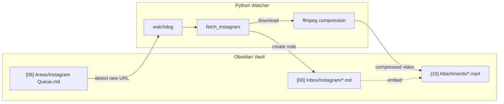

# Obsidian Instagram Automation System

## Architecture



## File Structure

```
instagram/
├── fetch_instagram.py      # Refactor to module (add CLI args)
├── obsidian_watcher.py     # New: file watcher daemon
└── requirements.txt        # Add watchdog dependency
```

## Implementation Steps

### 1. Refactor fetch_instagram.py

Modify [fetch_instagram.py](c:\Users\murta\Documents\programming\quick\instagram\fetch_instagram.py) to:

- Accept URL as command-line argument instead of hardcoded constant
- Accept custom output directory for markdown
- Accept custom output directory for video
- Add video compression function using ffmpeg (medium preset: CRF 28, scale to 720p max)
- Return paths to created files for the watcher to use

### 2. Create obsidian_watcher.py

New script that:

- Uses `watchdog` library to monitor `[06] Areas/Instagram Queue.md`
- Extracts Instagram URLs using regex pattern
- Tracks processed URLs in a `.processed_urls` file to avoid duplicates
- Calls the refactored `fetch_instagram` functions
- Saves compressed videos to `[10] Attachments/`
- Creates markdown notes in `[00] Inbox/Instagram/`
- Embeds video using Obsidian syntax: `![[filename.mp4]]`

### 3. Video Compression

Add ffmpeg compression with medium settings:

- CRF 28 (good balance of quality/size)
- Scale to max 720p height (preserves aspect ratio)
- H.264 codec for compatibility
- Expected ~70% size reduction

### 4. Markdown Note Format

Each processed reel creates a note like:

```markdown
---
source: https://instagram.com/reel/...
author: username
date: 2026-01-14
likes: 7069
comments: 31
---

# Reel Title

## Description
[content from reel]

## Video
![[reel_id.mp4]]

## Thumbnail

```

## Dependencies

- `watchdog` - file system monitoring
- `ffmpeg` - video compression (must be installed separately)